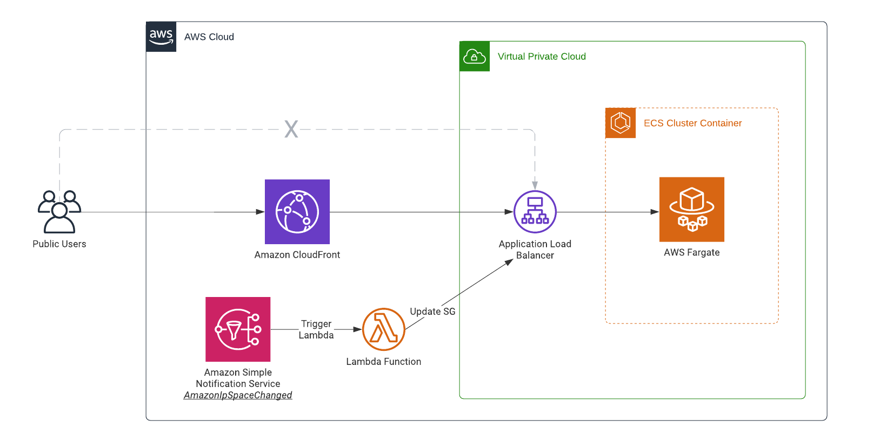

# Automatically Update Your Security Groups for Amazon CloudFront
[How to Automatically Update Your Security Groups for Amazon CloudFront and AWS WAF by Using AWS Lambda](https://aws.amazon.com/blogs/security/how-to-automatically-update-your-security-groups-for-amazon-cloudfront-and-aws-waf-by-using-aws-lambda/)



## Instructions
* Copy the .tfvars template to `terraform.tfvars`
```
$ cp example.tfvars terraform.tfvars
```
* Modify the parameters `zone_name` and `app_image` inside terraform.tfvars according to your environment. 
* ```$ terraform init```
* ```$ terraform plan```
* ```$ terraform apply```